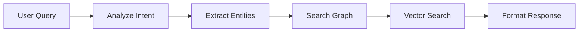

# Development Guide

## Setup Development Environment

1. Install development dependencies:
```bash
pip install -r requirements-dev.txt
```

2. Set up pre-commit hooks:
```bash
pre-commit install
```

## Code Structure

### Components

1. `knowledge_graph.py`
   - Neo4j database interface
   - Equipment and connection management
   - Query functionality

2. `pid_processor.py`
   - P&ID image processing
   - OpenAI Vision integration
   - Equipment and connection detection

3. `vector_store.py`
   - ChromaDB management
   - Vector embeddings
   - Similarity search

4. `nlp_processor.py`
   - Query processing
   - Intent analysis
   - Response generation

### Key Workflows

1. P&ID Processing:


2. Query Processing:



## Adding New Features

1. Create feature branch:
```bash
git checkout -b feature/your-feature-name
```

2. Implement feature:
   - Add tests first
   - Implement functionality
   - Update documentation
   - Add logging

3. Submit Pull Request:
   - Fill PR template
   - Request review
   - Address feedback

## Debugging

1. Enable debug logging:
```python
logging.basicConfig(level=logging.DEBUG)
```

2. Use debug endpoints:
```python
@app.route('/debug/graph')
def debug_graph():
    return knowledge_graph.debug_info()
```

3. Debug tools:
   - Neo4j Browser: http://localhost:7474
   - ChromaDB Interface
   - Gradio Debug Mode

## Deployment

1. Production Setup:
```bash
# Install production dependencies
pip install -r requirements.txt

# Set environment variables
export OPENAI_API_KEY=your_key
export NEO4J_URI=your_uri
```

## Troubleshooting

Common Issues:
1. Neo4j Connection:
   - Check credentials
   - Verify network access
   - Check logs

2. OpenAI API:
   - API key validity
   - Rate limits
   - Request format

3. ChromaDB:
   - Storage path
   - Embedding dimension
   - Index errors

